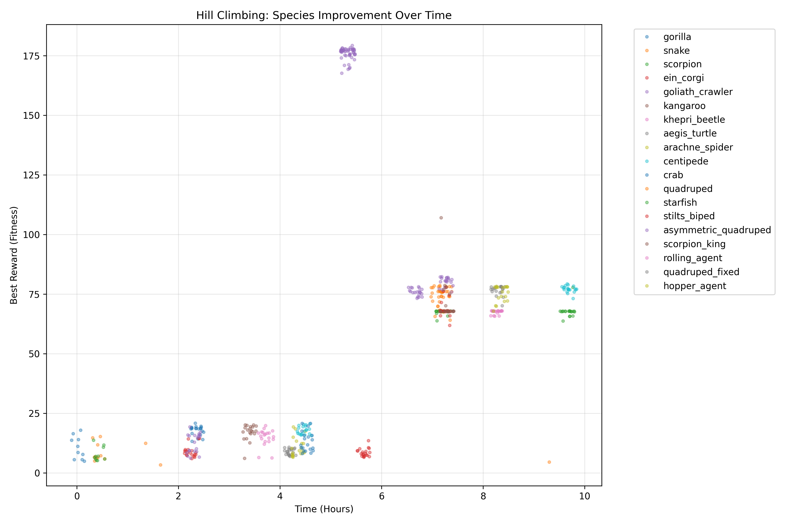
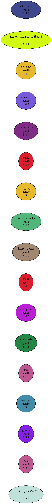

# Simulation Leaderboard

## Summary Stats
- **Total Configs Evaluated**: 518
- **Total Species/Variants**: 67
- **Top Performer**: goliath_crawler__evolved (Score: 6.90)
- **Plot Insights**:
  - *Timeline*: Distinct clusters of high-intensity evolution separated by gaps.
  - *Progression*: Upward slope in reward clusters indicates successful optimization over time.
  - *Density*: Overlapping points show high concentration of similar performers in successful generations.

## Evolution Progress

## Rankings
| Rank | Config | Score | Distance | Survival | Food | Breeding |
|------|--------|-------|----------|----------|------|----------|
| 1 | goliath_crawler__evolved | 6.90 | 3.34 | 10.0 | 0 | 0 |
| 2 | snake__5a51e2d0__gen20 | 6.88 | 4.21 | 10.0 | 0 | 0 |
| 3 | ein_corgi__cecd8ed9__gen20 | 6.81 | 3.73 | 10.0 | 0 | 0 |
| 4 | kangaroo_default | 6.78 | 4.31 | 10.0 | 0 | 0 |
| 5 | snake__9a8a1db8__gen20 | 6.69 | 4.44 | 10.0 | 0 | 0 |
| 6 | khepri_beetle__9675d3cb__gen20_3 | 6.69 | 4.31 | 10.0 | 0 | 0 |
| 7 | goliath_crawler__d4beafdd__gen50 | 6.58 | 2.68 | 10.0 | 0 | 0 |
| 8 | quadruped__0946fd96__gen20_0 | 6.55 | 5.98 | 10.0 | 1 | 0 |
| 9 | giraffe_default__8102c84e__gen20_2 | 6.53 | 4.50 | 10.0 | 0 | 0 |
| 10 | goliath_crawler__9d86ac27__gen20_19 | 6.50 | 3.84 | 10.0 | 0 | 0 |
| 11 | giraffe_default__be67c853__gen20_4 | 6.49 | 2.98 | 10.0 | 0 | 0 |
| 12 | legion_hexapod__99a9b3ff__gen20_2 | 6.47 | 3.60 | 10.0 | 0 | 0 |
| 13 | arachne_spider__b57cbc66__gen20_6 | 6.41 | 5.14 | 10.0 | 0 | 0 |
| 14 | giraffe_default__99faa514__gen20_0 | 6.34 | 3.05 | 10.0 | 0 | 0 |
| 15 | goliath_crawler__2642d7c5__gen20_4 | 6.33 | 2.01 | 10.0 | 0 | 0 |
| 16 | goliath_crawler__88ab0cba__gen20 | 6.28 | 6.77 | 10.0 | 0 | 0 |
| 17 | arachne_spider__b57cbc66__gen20_1 | 6.28 | 3.12 | 10.0 | 0 | 0 |
| 18 | giraffe_default__99faa514__gen20_6 | 6.27 | 4.24 | 10.0 | 0 | 0 |
| 19 | quadruped__85dd21d7__gen20 | 6.24 | 4.96 | 10.0 | 0 | 0 |
| 20 | starfish_default | 6.15 | 2.58 | 10.0 | 1 | 0 |
| 21 | ein_corgi__3f2b1218 | 6.14 | 3.47 | 10.0 | 0 | 0 |
| 22 | aegis_turtle__d5fb7a33__gen20_9 | 6.12 | 1.30 | 10.0 | 0 | 0 |
| 23 | quadruped__60c1a634__gen20 | 6.09 | 2.81 | 10.0 | 0 | 0 |
| 24 | giraffe_default__da6793c5__gen20_0 | 6.07 | 1.36 | 10.0 | 0 | 0 |
| 25 | starfish_0000 | 6.07 | 4.19 | 10.0 | 1 | 0 |
| 26 | aegis_turtle__cc9c672f__gen20_3 | 6.06 | 4.72 | 10.0 | 0 | 0 |
| 27 | arachne_spider__15d3b324__gen20 | 6.05 | 1.44 | 10.0 | 0 | 0 |
| 28 | legion_hexapod__39f7e11f__gen20_25 | 6.04 | 2.16 | 10.0 | 0 | 0 |
| 29 | aegis_turtle__d5fb7a33__gen20 | 6.04 | 6.62 | 10.0 | 0 | 0 |
| 30 | quadruped__0946fd96__gen20 | 6.02 | 2.59 | 10.0 | 0 | 0 |
| 31 | hercules_default | 5.93 | 5.00 | 10.0 | 0 | 0 |
| 32 | goliath_crawler__06ac2a4e__gen20_17 | 5.91 | 6.92 | 10.0 | 0 | 0 |
| 33 | legion_hexapod__669a2e2d__gen20_15 | 5.90 | 5.83 | 10.0 | 0 | 0 |
| 34 | quadruped__3ed3bef3__gen20 | 5.88 | 3.06 | 10.0 | 0 | 0 |
| 35 | legion_hexapod__83491b1c__gen20_16 | 5.85 | 5.85 | 10.0 | 0 | 0 |
| 36 | quadruped__49d55732__gen20_13 | 5.85 | 4.87 | 10.0 | 1 | 0 |
| 37 | legion_hexapod__08f9da17__gen20_5 | 5.83 | 2.32 | 10.0 | 0 | 0 |
| 38 | gorilla__8169ac7e__gen20 | 5.80 | 4.22 | 10.0 | 0 | 0 |
| 39 | snake__809688e9__gen20_6 | 5.76 | 4.86 | 10.0 | 0 | 0 |
| 40 | arachne_spider__ed6b0b64__gen50 | 5.75 | 2.78 | 10.0 | 0 | 0 |
| 41 | goliath_crawler__2a034c94__gen20 | 5.74 | 4.68 | 10.0 | 0 | 0 |
| 42 | horse_default | 5.72 | 4.42 | 10.0 | 0 | 0 |
| 43 | ein_corgi__dad13d3f__gen20_3 | 5.71 | 4.65 | 10.0 | 0 | 0 |
| 44 | megapede__951d2e61__gen50 | 5.69 | 5.37 | 10.0 | 0 | 0 |
| 45 | aegis_turtle__f4dd28c0__gen20 | 5.68 | 1.09 | 10.0 | 0 | 0 |
| 46 | legion_hexapod__08f9da17__gen20_12 | 5.67 | 1.93 | 10.0 | 0 | 0 |
| 47 | goliath_crawler__81be13fe__gen20 | 5.65 | 4.88 | 10.0 | 0 | 0 |
| 48 | aegis_23 | 5.62 | 4.07 | 10.0 | 0 | 0 |
| 49 | goliath_crawler__06ac2a4e__gen20_2 | 5.59 | 2.03 | 10.0 | 0 | 0 |
| 50 | ein_corgi__6892ee45__gen20_7 | 5.59 | 4.04 | 10.0 | 0 | 0 |
| 51 | legion_hexapod__e6e2825b__gen20 | 5.58 | 6.25 | 10.0 | 0 | 0 |
| 52 | khepri_beetle__fa837806__gen20 | 5.57 | 5.50 | 10.0 | 0 | 0 |
| 53 | stilts_biped__027c957e__gen20 | 5.56 | 4.94 | 10.0 | 1 | 0 |
| 54 | gorilla_default | 5.56 | 3.56 | 10.0 | 0 | 0 |
| 55 | quadruped__3e28aa35__gen20 | 5.54 | 6.34 | 10.0 | 0 | 0 |
| 56 | khepri_beetle__8bfc4cbb__gen20 | 5.54 | 2.56 | 10.0 | 0 | 0 |
| 57 | giraffe_default__da6793c5__gen20 | 5.51 | 5.46 | 10.0 | 0 | 0 |
| 58 | goliath_crawler__ceccaed0__gen20_5 | 5.50 | 0.35 | 10.0 | 0 | 0 |
| 59 | arachne_spider | 5.49 | 4.47 | 10.0 | 0 | 0 |
| 60 | scorpion_default | 5.49 | 3.73 | 10.0 | 0 | 0 |
| 61 | arachne_spider__3a067005__gen20_16 | 5.47 | 4.99 | 10.0 | 1 | 0 |
| 62 | giraffe_default__c8afed5d__gen20 | 5.45 | 3.76 | 10.0 | 0 | 0 |
| 63 | quadruped__163c26ad__gen20 | 5.43 | 4.49 | 10.0 | 0 | 0 |
| 64 | gorilla__d71f556e__gen20 | 5.41 | 4.76 | 10.0 | 0 | 0 |
| 65 | quadruped__1a71c1f3__gen20 | 5.39 | 4.69 | 10.0 | 0 | 0 |
| 66 | legion_hexapod__1a97ab9c__gen20 | 5.38 | 4.61 | 10.0 | 0 | 0 |
| 67 | aegis_turtle__b228c2b8__gen20_12 | 5.37 | 4.10 | 10.0 | 0 | 0 |
| 68 | aegis_turtle__9cdfb45a__gen20 | 5.37 | 4.68 | 10.0 | 0 | 0 |
| 69 | legion_hexapod__4ad15990 | 5.36 | 5.93 | 10.0 | 0 | 0 |
| 70 | gorilla__1229d38b__gen10 | 5.35 | 3.33 | 10.0 | 0 | 0 |
| 71 | khepri_beetle__3fcf682b__gen20 | 5.34 | 2.15 | 10.0 | 0 | 0 |
| 72 | arachne_spider__680a147f__gen20_6 | 5.31 | 2.02 | 10.0 | 0 | 0 |
| 73 | rolling_agent | 5.30 | 3.02 | 10.0 | 0 | 0 |
| 74 | quadruped__3180f4fe__gen20 | 5.29 | 3.28 | 10.0 | 0 | 0 |
| 75 | khepri_beetle__09001214__gen20 | 5.28 | 4.99 | 10.0 | 0 | 0 |
| 76 | snake__809688e9__gen20_14 | 5.27 | 4.55 | 10.0 | 0 | 0 |
| 77 | legion_hexapod__39f7e11f__gen20 | 5.27 | 3.67 | 10.0 | 0 | 0 |
| 78 | goliath_crawler__ceccaed0__gen20_17 | 5.27 | 2.66 | 10.0 | 0 | 0 |
| 79 | scorpion_king__136e1be5__gen20 | 5.26 | 3.50 | 10.0 | 0 | 0 |
| 80 | goliath_crawler__2642d7c5__gen20_19 | 5.25 | 3.43 | 10.0 | 0 | 0 |
| 81 | ein_corgi__5bb450d0__gen20 | 5.24 | 5.36 | 10.0 | 0 | 0 |
| 82 | legion_hexapod__1a97ab9c__gen20_9 | 5.24 | 1.35 | 10.0 | 0 | 0 |
| 83 | khepri_beetle__f389ae06__gen20_2 | 5.24 | 3.72 | 10.0 | 0 | 0 |
| 84 | quadruped__9422b36b__gen20 | 5.23 | 5.04 | 10.0 | 0 | 0 |
| 85 | starfish__0e011b3c__gen20 | 5.23 | 3.51 | 10.0 | 0 | 0 |
| 86 | khepri_beetle__f32cceb5__gen20_8 | 5.23 | 3.00 | 10.0 | 0 | 0 |
| 87 | legion_hexapod__4f4e878b__gen20 | 5.21 | 4.58 | 10.0 | 0 | 0 |
| 88 | ein_corgi__dad13d3f__gen20_1 | 5.18 | 2.13 | 10.0 | 0 | 0 |
| 89 | snake__809688e9__gen20_9 | 5.18 | 4.52 | 10.0 | 0 | 0 |
| 90 | goliath_crawler__c8aa0f29__gen20 | 5.17 | 1.38 | 10.0 | 0 | 0 |
| 91 | khepri_beetle__dd183e82__gen20 | 5.16 | 2.99 | 10.0 | 0 | 0 |
| 92 | aegis_turtle__d37f2e75__gen20_5 | 5.16 | 2.26 | 10.0 | 0 | 0 |
| 93 | legion_hexapod__83491b1c__gen20 | 5.14 | 5.65 | 10.0 | 0 | 0 |
| 94 | khepri_beetle__94ef9ae4__gen20_3 | 5.13 | 5.53 | 10.0 | 0 | 0 |
| 95 | khepri_beetle__94ef9ae4__gen20 | 5.13 | 4.73 | 10.0 | 0 | 0 |
| 96 | Giraffe_default_36e04a49 | 5.12 | 4.95 | 10.0 | 0 | 0 |
| 97 | goliath_crawler__ceccaed0__gen20_3 | 5.10 | 0.52 | 10.0 | 0 | 0 |
| 98 | ein_corgi__5bb450d0__gen20_12 | 5.08 | 2.14 | 10.0 | 0 | 0 |
| 99 | snake__7ff33459__gen1 | 5.08 | 3.52 | 10.0 | 0 | 0 |
| 100 | legion_hexapod__83491b1c__gen20_7 | 5.05 | 3.56 | 10.0 | 0 | 0 |
| 101 | ein_corgi__dad13d3f__gen20_14 | 5.04 | 3.95 | 10.0 | 0 | 0 |
| 102 | khepri_beetle__3fcf682b__gen20_3 | 5.03 | 3.29 | 10.0 | 0 | 0 |
| 103 | giraffe_default__9ec68be6__gen20 | 5.02 | 4.60 | 10.0 | 1 | 0 |
| 104 | arachne_spider__41bcd6f5__gen20 | 5.01 | 2.64 | 10.0 | 0 | 0 |
| 105 | legion_hexapod__690e6abe__gen20 | 5.01 | 4.30 | 10.0 | 0 | 0 |
| 106 | legion_hexapod__83491b1c__gen20_0 | 5.00 | 6.43 | 10.0 | 0 | 0 |
| 107 | goliath_crawler__ceccaed0__gen20_9 | 4.99 | 4.74 | 10.0 | 0 | 0 |
| 108 | arachne_spider__b344189b__gen20 | 4.99 | 4.95 | 10.0 | 0 | 0 |
| 109 | goliath_crawler__f2a7591e__gen50 | 4.98 | 2.53 | 10.0 | 0 | 0 |
| 110 | aegis_turtle__0f1ec654__gen50 | 4.97 | 3.75 | 10.0 | 0 | 0 |
| 111 | legion_hexapod__33f0f7ed__gen20_8 | 4.96 | 0.49 | 10.0 | 0 | 0 |
| 112 | arachne_spider__1115a638__gen20_16 | 4.96 | 3.48 | 10.0 | 0 | 0 |
| 113 | aegis_turtle__5afc5924__gen20 | 4.95 | 2.64 | 10.0 | 0 | 0 |
| 114 | legion_hexapod__e6e2825b__gen20_21 | 4.95 | 1.46 | 10.0 | 0 | 0 |
| 115 | quadruped__56d3be83__gen20 | 4.94 | 3.78 | 10.0 | 0 | 0 |
| 116 | aegis_turtle__9cdfb45a__gen20_3 | 4.94 | 4.92 | 10.0 | 1 | 0 |
| 117 | khepri_beetle__f32cceb5__gen20 | 4.93 | 6.33 | 10.0 | 0 | 0 |
| 118 | centipede__f2014f2d__gen20 | 4.93 | 6.50 | 10.0 | 0 | 0 |
| 119 | quadruped__be8421f4__gen20 | 4.92 | 2.63 | 10.0 | 0 | 0 |
| 120 | crab_default | 4.91 | 2.01 | 10.0 | 0 | 0 |
| 121 | quadruped__55dcb287__gen20 | 4.91 | 5.51 | 10.0 | 0 | 0 |
| 122 | ein_corgi__dad13d3f__gen20_7 | 4.91 | 3.30 | 10.0 | 0 | 0 |
| 123 | ein_corgi__28aeb2dd__gen20 | 4.90 | 4.62 | 10.0 | 0 | 0 |
| 124 | quadruped__8c23e2c0__gen50 | 4.89 | 2.37 | 10.0 | 0 | 0 |
| 125 | khepri_beetle__9675d3cb__gen20_6 | 4.89 | 3.93 | 10.0 | 0 | 0 |
| 126 | goliath_crawler__0fac9fa0__gen20 | 4.88 | 2.48 | 10.0 | 0 | 0 |
| 127 | starfish__79781680__gen20_1 | 4.87 | 1.74 | 10.0 | 0 | 0 |
| 128 | khepri_beetle__9675d3cb__gen20_23 | 4.84 | 6.58 | 10.0 | 0 | 0 |
| 129 | goliath_crawler__2b282d80__gen20 | 4.83 | 5.33 | 10.0 | 0 | 0 |
| 130 | stilts_biped__027c957e__gen20_1 | 4.81 | 4.80 | 10.0 | 0 | 0 |
| 131 | Legion_11 | 4.81 | 4.22 | 10.0 | 0 | 0 |
| 132 | goliath_crawler__ceccaed0__gen20 | 4.81 | 4.37 | 10.0 | 0 | 0 |
| 133 | arachne_spider__1115a638__gen20_0 | 4.80 | 3.60 | 10.0 | 0 | 0 |
| 134 | arachne_spider__680a147f__gen20 | 4.80 | 5.32 | 10.0 | 0 | 0 |
| 135 | legion_hexapod__99a9b3ff__gen20 | 4.79 | 4.04 | 10.0 | 0 | 0 |
| 136 | ein_corgi__401bad27__gen20 | 4.79 | 5.79 | 10.0 | 0 | 0 |
| 137 | ein_corgi__28aeb2dd__gen20_5 | 4.79 | 5.02 | 10.0 | 0 | 0 |
| 138 | giraffe_default__be67c853__gen20 | 4.79 | 2.22 | 10.0 | 0 | 0 |
| 139 | aegis_turtle__f144282b__gen20 | 4.78 | 4.60 | 10.0 | 0 | 0 |
| 140 | centipede__163b1b5d__gen20 | 4.78 | 5.86 | 10.0 | 1 | 0 |
| 141 | ein_corgi__1b52a473__gen20 | 4.77 | 4.71 | 10.0 | 0 | 0 |
| 142 | arachne_spider__e341b498__gen20_7 | 4.77 | 4.51 | 10.0 | 0 | 0 |
| 143 | aegis_turtle | 4.76 | 5.08 | 10.0 | 0 | 0 |
| 144 | aegis_turtle__2b9cfe8e | 4.74 | 5.85 | 10.0 | 0 | 0 |
| 145 | quadruped__5cd89831__gen20 | 4.73 | 6.70 | 10.0 | 0 | 0 |
| 146 | goliath_crawler__ceccaed0__gen20_10 | 4.72 | 5.40 | 10.0 | 0 | 0 |
| 147 | goliath_crawler__4359ebf1__gen20_6 | 4.72 | 5.51 | 10.0 | 0 | 0 |
| 148 | goliath_crawler__06ac2a4e__gen20 | 4.70 | 1.58 | 10.0 | 0 | 0 |
| 149 | khepri_beetle__9675d3cb__gen20 | 4.70 | 3.93 | 10.0 | 0 | 0 |
| 150 | goliath_crawler__91ebacb4__gen20 | 4.70 | 2.42 | 10.0 | 0 | 0 |
| 151 | elephant_default | 4.69 | 4.25 | 10.0 | 0 | 0 |
| 152 | legion_hexapod__9fa2ad7e__gen20_7 | 4.69 | 5.91 | 10.0 | 0 | 0 |
| 153 | aegis_turtle__b228c2b8__gen20_13 | 4.69 | 1.56 | 10.0 | 0 | 0 |
| 154 | khepri_beetle__9675d3cb__gen20_13 | 4.67 | 5.98 | 10.0 | 0 | 0 |
| 155 | quadruped_fixed__a6e6c7d3__gen20 | 4.66 | 2.34 | 10.0 | 0 | 0 |
| 156 | arachne_spider_0000 | 4.65 | 2.71 | 10.0 | 0 | 0 |
| 157 | khepri_beetle__evolved | 4.64 | 4.28 | 10.0 | 0 | 0 |
| 158 | goliath_crawler__2f8e8053__gen20 | 4.64 | 3.72 | 10.0 | 0 | 0 |
| 159 | legion_hexapod__a064005b__gen20 | 4.64 | 3.57 | 10.0 | 0 | 0 |
| 160 | legion_hexapod__9fa2ad7e__gen20_9 | 4.64 | 6.36 | 10.0 | 0 | 0 |
| 161 | goliath_crawler__69aa365f__gen20 | 4.63 | 1.94 | 10.0 | 0 | 0 |
| 162 | aegis_turtle__evolved | 4.62 | 0.63 | 10.0 | 1 | 0 |
| 163 | goliath_crawler__ceccaed0__gen20_14 | 4.62 | 3.00 | 10.0 | 0 | 0 |
| 164 | mantis_default | 4.59 | 5.02 | 10.0 | 0 | 0 |
| 165 | goliath_crawler | 4.59 | 1.11 | 10.0 | 0 | 0 |
| 166 | ein_corgi__5994bdca__gen20 | 4.59 | 3.82 | 10.0 | 0 | 0 |
| 167 | ein_corgi__69e64ff2__gen20 | 4.59 | 2.58 | 10.0 | 0 | 0 |
| 168 | arachne_spider__d11261f2__gen20 | 4.58 | 2.93 | 10.0 | 0 | 0 |
| 169 | aegis_turtle__f144282b__gen20_0 | 4.57 | 2.63 | 10.0 | 0 | 0 |
| 170 | aegis_turtle__f144282b__gen20_6 | 4.57 | 2.80 | 10.0 | 0 | 0 |
| 171 | giraffe_default__e74dd564__gen20 | 4.56 | 3.91 | 10.0 | 0 | 0 |
| 172 | scorpion__4f1fc2b9__gen20 | 4.56 | 3.91 | 10.0 | 0 | 0 |
| 173 | quadruped__3158f2eb__gen20_0 | 4.56 | 4.73 | 10.0 | 0 | 0 |
| 174 | giraffe__evolved | 4.56 | 2.93 | 10.0 | 0 | 0 |
| 175 | gorilla__bc52cc60__gen20 | 4.55 | 2.49 | 10.0 | 0 | 0 |
| 176 | arachne_spider__b57cbc66__gen20_5 | 4.55 | 0.97 | 10.0 | 0 | 0 |
| 177 | khepri_beetle__9675d3cb__gen20_4 | 4.54 | 3.41 | 10.0 | 1 | 0 |
| 178 | rolling_agent__39844e01__gen20 | 4.52 | 5.91 | 10.0 | 0 | 0 |
| 179 | aegis_turtle__e118c1a4__gen20_9 | 4.51 | 4.39 | 10.0 | 0 | 0 |
| 180 | ein_corgi | 4.50 | 5.76 | 10.0 | 0 | 0 |
| 181 | quadruped__57dcdc56__gen20 | 4.50 | 3.13 | 10.0 | 0 | 0 |
| 182 | aegis_turtle__74a28488__gen20 | 4.49 | 6.11 | 10.0 | 0 | 0 |
| 183 | goliath_crawler__88ab0cba__gen20_20 | 4.49 | 4.15 | 10.0 | 0 | 0 |
| 184 | arachne_spider__b57cbc66__gen20 | 4.47 | 2.46 | 10.0 | 0 | 0 |
| 185 | snake__bd33864a__gen1 | 4.46 | 1.68 | 10.0 | 0 | 0 |
| 186 | legion_hexapod__83491b1c__gen20_4 | 4.44 | 1.27 | 10.0 | 0 | 0 |
| 187 | aegis_turtle__b228c2b8__gen20_7 | 4.43 | 4.61 | 10.0 | 1 | 0 |
| 188 | legion_hexapod__4f4e878b__gen20_4 | 4.42 | 2.14 | 10.0 | 0 | 0 |
| 189 | Legion_hexapod_a53bce88 | 4.41 | 4.85 | 10.0 | 0 | 0 |
| 190 | quadruped__quad_5 | 4.40 | 4.48 | 8.4 | 1 | 10 |
| 191 | legion_hexapod__99a9b3ff__gen20_8 | 4.39 | 4.07 | 10.0 | 1 | 0 |
| 192 | aegis_turtle__d97707b6__gen50 | 4.38 | 3.29 | 10.0 | 0 | 0 |
| 193 | arachne_spider__0f23c9a5__gen20_7 | 4.38 | 2.80 | 10.0 | 0 | 0 |
| 194 | aegis_turtle__6ab5045c__gen20 | 4.37 | 3.85 | 10.0 | 0 | 0 |
| 195 | stilts_biped__47f9883c__gen20 | 4.36 | 2.66 | 10.0 | 0 | 0 |
| 196 | dragon_default | 4.35 | 4.19 | 10.0 | 0 | 0 |
| 197 | legion_hexapod__33f0f7ed__gen20_0 | 4.35 | 4.17 | 10.0 | 0 | 0 |
| 198 | stingray_default | 4.35 | 3.11 | 10.0 | 0 | 0 |
| 199 | stilts_biped__47f59c7c__gen20 | 4.34 | 3.51 | 10.0 | 0 | 0 |
| 200 | legion_hexapod__8e6537e3__gen20_11 | 4.34 | 2.98 | 10.0 | 0 | 0 |
| 201 | quadruped__92a891e0__gen20 | 4.34 | 5.18 | 10.0 | 1 | 0 |
| 202 | snake__e7783d07__gen20 | 4.33 | 5.74 | 10.0 | 1 | 0 |
| 203 | centipede__9e6e08e6__gen20_0 | 4.33 | 3.15 | 10.0 | 0 | 0 |
| 204 | goliath_crawler__3c2a334b__gen20 | 4.31 | 0.92 | 10.0 | 0 | 0 |
| 205 | legion_hexapod__0ec9748e__gen50 | 4.31 | 2.72 | 10.0 | 0 | 0 |
| 206 | khepri_beetle__9675d3cb__gen20_12 | 4.31 | 4.87 | 10.0 | 1 | 0 |
| 207 | legion_hexapod__08f9da17__gen20_4 | 4.30 | 2.74 | 10.0 | 0 | 0 |
| 208 | giraffe_default__be67c853__gen20_1 | 4.29 | 3.37 | 10.0 | 0 | 0 |
| 209 | giraffe_default__69664eb6__gen20_1 | 4.29 | 3.82 | 10.0 | 0 | 0 |
| 210 | aegis_turtle__bb066d66__gen20 | 4.28 | 2.76 | 10.0 | 0 | 0 |
| 211 | aegis_turtle__7a42b510__gen20 | 4.28 | 0.12 | 10.0 | 0 | 0 |
| 212 | goliath_crawler__ceccaed0__gen20_13 | 4.28 | 5.80 | 10.0 | 0 | 0 |
| 213 | khepri_beetle__3fcf682b__gen20_26 | 4.27 | 3.42 | 10.0 | 0 | 0 |
| 214 | khepri_beetle__4fa26af5__gen20 | 4.27 | 4.89 | 10.0 | 0 | 0 |
| 215 | quadruped__87ec2774__gen20 | 4.27 | 5.76 | 10.0 | 0 | 0 |
| 216 | ein_corgi_0000 | 4.27 | 4.09 | 10.0 | 0 | 0 |
| 217 | kangaroo__7be6a7dc__gen20 | 4.27 | 3.60 | 10.0 | 0 | 0 |
| 218 | goliath_crawler__614f677d__gen20_9 | 4.26 | 4.38 | 10.0 | 0 | 0 |
| 219 | starfish__d54e8c01__gen20 | 4.26 | 4.05 | 10.0 | 0 | 0 |
| 220 | quadruped_fixed | 4.25 | 5.86 | 10.0 | 0 | 0 |
| 221 | goliath_crawler__ceccaed0__gen20_4 | 4.23 | 3.13 | 10.0 | 0 | 0 |
| 222 | giraffe_best | 4.22 | 6.09 | 10.0 | 1 | 0 |
| 223 | giraffe_default__69664eb6__gen20_6 | 4.21 | 6.20 | 10.0 | 0 | 0 |
| 224 | ein_corgi__1c31750c__gen20_11 | 4.20 | 2.16 | 10.0 | 0 | 0 |
| 225 | khepri_beetle__9aeb1626__gen20 | 4.19 | 3.41 | 10.0 | 0 | 0 |
| 226 | quadruped__1332f9ee__gen20 | 4.19 | 5.10 | 10.0 | 0 | 0 |
| 227 | legion_hexapod__e87004f7__gen20 | 4.16 | 5.02 | 10.0 | 0 | 0 |
| 228 | arachne_spider__1115a638__gen20_7 | 4.15 | 3.65 | 10.0 | 0 | 0 |
| 229 | khepri_beetle__fe9be525__gen20 | 4.14 | 5.38 | 10.0 | 0 | 0 |
| 230 | arachne_spider__7ebf52b9__gen20_7 | 4.14 | 5.63 | 10.0 | 0 | 0 |
| 231 | quadruped__55dcb287__gen20_10 | 4.12 | 3.76 | 10.0 | 0 | 0 |
| 232 | tarantula_default | 4.12 | 4.68 | 10.0 | 0 | 0 |
| 233 | ein_corgi__3c9e12ca__gen50 | 4.12 | 1.01 | 10.0 | 0 | 0 |
| 234 | khepri_beetle__5a60eec6__gen20_9 | 4.06 | 4.96 | 10.0 | 0 | 0 |
| 235 | goliath_crawler__9d86ac27__gen20_6 | 4.06 | 1.18 | 10.0 | 0 | 0 |
| 236 | arachne_spider__e341b498__gen20_14 | 4.05 | 0.41 | 10.0 | 0 | 0 |
| 237 | legion_hexapod__669a2e2d__gen20 | 4.05 | 4.63 | 10.0 | 0 | 0 |
| 238 | quadruped__57dcdc56__gen20_14 | 4.04 | 2.77 | 10.0 | 0 | 0 |
| 239 | quadruped__356ea058__gen20 | 4.04 | 2.60 | 10.0 | 0 | 0 |
| 240 | quadruped_0000 | 4.04 | 2.17 | 10.0 | 0 | 0 |
| 241 | goliath_crawler__ceccaed0__gen20_8 | 4.04 | 4.98 | 10.0 | 0 | 0 |
| 242 | legion_hexapod__669a2e2d__gen20_16 | 4.03 | 1.08 | 10.0 | 0 | 0 |
| 243 | arachne_spider__7ebf52b9__gen20_10 | 4.02 | 1.47 | 10.0 | 0 | 0 |
| 244 | quadruped__1b018877__gen20 | 4.01 | 4.98 | 10.0 | 0 | 0 |
| 245 | megarachne_default | 4.01 | 3.65 | 10.0 | 0 | 0 |
| 246 | scorpion__c1c1873c__gen20 | 4.00 | 4.18 | 10.0 | 0 | 0 |
| 247 | aegis_turtle__d77a1bbf__gen20_2 | 3.99 | 1.25 | 10.0 | 0 | 0 |
| 248 | goliath_crawler__e33f9c12__gen20 | 3.98 | 5.16 | 10.0 | 0 | 0 |
| 249 | aegis_turtle__d952330b | 3.96 | 0.29 | 10.0 | 0 | 0 |
| 250 | arachne_spider__b344189b__gen20_0 | 3.96 | 2.91 | 10.0 | 0 | 0 |
| 251 | khepri_beetle | 3.96 | 3.81 | 10.0 | 0 | 0 |
| 252 | aegis_turtle__18b94420__gen20 | 3.95 | 1.89 | 10.0 | 0 | 0 |
| 253 | arachne_spider__1115a638__gen20_2 | 3.94 | 4.33 | 10.0 | 1 | 0 |
| 254 | megapede_default | 3.94 | 3.63 | 10.0 | 0 | 0 |
| 255 | giraffe_default__99faa514__gen20 | 3.94 | 2.55 | 10.0 | 0 | 0 |
| 256 | arachne_spider__3a067005__gen20 | 3.94 | 5.10 | 10.0 | 0 | 0 |
| 257 | aegis_turtle__4db54cc2__gen20 | 3.94 | 6.33 | 10.0 | 0 | 0 |
| 258 | giraffe_default__f8be4e2f__gen20 | 3.93 | 2.32 | 10.0 | 0 | 0 |
| 259 | giraffe_default__be67c853__gen20_13 | 3.93 | 3.50 | 10.0 | 0 | 0 |
| 260 | gorilla__88efbe93__gen20 | 3.93 | 5.01 | 10.0 | 0 | 0 |
| 261 | ein_corgi__5bb450d0__gen20_19 | 3.92 | 4.28 | 10.0 | 0 | 0 |
| 262 | giraffe__7519a19f | 3.90 | 2.30 | 10.0 | 0 | 0 |
| 263 | goliath_crawler__1a83f221__gen20 | 3.90 | 2.17 | 10.0 | 0 | 0 |
| 264 | khepri_beetle__bccfefdc__gen20 | 3.89 | 4.71 | 10.0 | 0 | 0 |
| 265 | scorpion_0000 | 3.88 | 4.04 | 10.0 | 0 | 0 |
| 266 | aegis_turtle__b228c2b8__gen20 | 3.88 | 4.87 | 10.0 | 0 | 0 |
| 267 | goliath_crawler__2b282d80__gen20_7 | 3.85 | 5.81 | 10.0 | 0 | 0 |
| 268 | legion_hexapod__08f9da17__gen20 | 3.83 | 1.61 | 10.0 | 0 | 0 |
| 269 | scorpion__fb1b7306__gen20 | 3.83 | 2.29 | 10.0 | 0 | 0 |
| 270 | legion_hexapod__1a97ab9c__gen20_7 | 3.82 | 1.79 | 10.0 | 0 | 0 |
| 271 | legion_hexapod__33f0f7ed__gen20_5 | 3.82 | 4.52 | 10.0 | 0 | 0 |
| 272 | megapede__acbae737__gen50 | 3.81 | 1.16 | 10.0 | 0 | 0 |
| 273 | ein_corgi__dad13d3f__gen20_2 | 3.81 | 5.24 | 10.0 | 0 | 0 |
| 274 | aegis_turtle__d77a1bbf__gen20_15 | 3.81 | 4.86 | 10.0 | 0 | 0 |
| 275 | legion_hexapod__3467bcc5__gen20 | 3.81 | 1.45 | 10.0 | 0 | 0 |
| 276 | ein_corgi__7390bf1d__gen20 | 3.81 | 1.73 | 10.0 | 0 | 0 |
| 277 | giraffe_default__ec3bce69__gen20 | 3.80 | 5.54 | 10.0 | 0 | 0 |
| 278 | starfish__e81a58c8__gen20 | 3.79 | 2.27 | 10.0 | 0 | 0 |
| 279 | arachne_spider__b57cbc66__gen20_10 | 3.79 | 4.72 | 10.0 | 0 | 0 |
| 280 | arachne_spider__1115a638__gen20_8 | 3.77 | 1.96 | 10.0 | 0 | 0 |
| 281 | ein_corgi__fc7d9f01__gen20 | 3.76 | 3.52 | 10.0 | 0 | 0 |
| 282 | starfish__79781680__gen20_9 | 3.76 | 3.34 | 10.0 | 0 | 0 |
| 283 | gorilla__24c84f2a__gen20 | 3.76 | 4.14 | 10.0 | 0 | 0 |
| 284 | legion_hexapod__8e6537e3__gen20 | 3.76 | 5.44 | 10.0 | 0 | 0 |
| 285 | goliath_crawler__cc9bc7b8__gen20 | 3.74 | 5.46 | 10.0 | 0 | 0 |
| 286 | stilts_biped__evolved | 3.74 | 3.17 | 10.0 | 0 | 0 |
| 287 | legion_hexapod__99a9b3ff__gen20_7 | 3.74 | 3.65 | 10.0 | 0 | 0 |
| 288 | giraffe_default__da6793c5__gen20_19 | 3.73 | 2.05 | 10.0 | 0 | 0 |
| 289 | arachne_spider__680a147f__gen20_8 | 3.72 | 4.73 | 10.0 | 0 | 0 |
| 290 | goliath_crawler__9f2b9193__gen20_8 | 3.72 | 4.88 | 10.0 | 0 | 0 |
| 291 | starfish__08435e24__gen20 | 3.72 | 3.10 | 10.0 | 0 | 0 |
| 292 | ein_corgi__28aeb2dd__gen20_12 | 3.70 | 4.78 | 10.0 | 0 | 0 |
| 293 | arachne_spider__e341b498__gen20 | 3.69 | 0.88 | 10.0 | 0 | 0 |
| 294 | giraffe_default__8102c84e__gen20 | 3.69 | 2.18 | 10.0 | 0 | 0 |
| 295 | quadruped__6c6d31c0__gen20 | 3.69 | 3.81 | 10.0 | 0 | 0 |
| 296 | khepri_beetle__5a60eec6__gen20_2 | 3.67 | 3.91 | 10.0 | 1 | 0 |
| 297 | arachne_spider__e341b498__gen20_3 | 3.67 | 3.90 | 10.0 | 0 | 0 |
| 298 | goliath_crawler__4359ebf1__gen20_14 | 3.67 | 2.68 | 10.0 | 0 | 0 |
| 299 | ein_corgi__evolved | 3.64 | 4.43 | 10.0 | 0 | 0 |
| 300 | arachne_spider__1115a638__gen20_5 | 3.64 | 3.74 | 10.0 | 0 | 0 |
| 301 | goliath_crawler__ceccaed0__gen20_6 | 3.63 | 4.68 | 10.0 | 0 | 0 |
| 302 | centipede__9e6e08e6__gen20 | 3.63 | 4.52 | 10.0 | 0 | 0 |
| 303 | stilts_biped__027c957e__gen20_18 | 3.62 | 3.53 | 10.0 | 0 | 0 |
| 304 | arachne_spider__c9d884c7__gen20 | 3.62 | 2.05 | 10.0 | 1 | 0 |
| 305 | quadruped__d88fb5c6__gen20 | 3.62 | 2.95 | 10.0 | 1 | 0 |
| 306 | centipede__ca08cb7f__gen20 | 3.62 | 1.96 | 10.0 | 0 | 0 |
| 307 | asymmetric_quadruped | 3.61 | 3.99 | 10.0 | 0 | 0 |
| 308 | legion_hexapod__39f7e11f__gen20_17 | 3.56 | 5.52 | 10.0 | 0 | 0 |
| 309 | khepri_beetle__5a60eec6__gen20_14 | 3.55 | 5.69 | 10.0 | 0 | 0 |
| 310 | snake_default | 3.54 | 3.46 | 10.0 | 0 | 0 |
| 311 | scorpion_king_default | 3.53 | 3.11 | 10.0 | 0 | 0 |
| 312 | snake__f0a6133a__gen10 | 3.53 | 5.98 | 10.0 | 0 | 0 |
| 313 | goliath_crawler__4359ebf1__gen20 | 3.52 | 5.32 | 10.0 | 0 | 0 |
| 314 | giraffe_default__45360919__gen20 | 3.50 | 4.49 | 10.0 | 1 | 0 |
| 315 | legion_hexapod_0000 | 3.49 | 3.32 | 10.0 | 0 | 0 |
| 316 | ein_corgi__091fa48a__gen20 | 3.49 | 4.64 | 10.0 | 0 | 0 |
| 317 | centipede__9e6e08e6__gen20_17 | 3.49 | 4.22 | 10.0 | 0 | 0 |
| 318 | aegis_turtle__d37f2e75__gen20_11 | 3.49 | 4.90 | 10.0 | 0 | 0 |
| 319 | mech_biped__18c3e099__gen50 | 3.48 | 4.74 | 10.0 | 0 | 0 |
| 320 | goliath_crawler__cc9bc7b8__gen20_27 | 3.47 | 5.83 | 10.0 | 0 | 0 |
| 321 | starfish__79781680__gen20 | 3.46 | 4.17 | 10.0 | 0 | 0 |
| 322 | crab__7e2cb1c3__gen50 | 3.46 | 3.41 | 10.0 | 0 | 0 |
| 323 | arachne_spider__680a147f__gen20_9 | 3.42 | 4.35 | 10.0 | 1 | 0 |
| 324 | arachne_spider__b57cbc66__gen20_11 | 3.41 | 4.83 | 10.0 | 0 | 0 |
| 325 | mech_biped_default | 3.40 | 6.06 | 10.0 | 0 | 0 |
| 326 | mech_biped__e773e5cf__gen20 | 3.39 | 3.18 | 10.0 | 0 | 0 |
| 327 | giraffe_default__b2dcd29b__gen20 | 3.38 | 2.12 | 10.0 | 0 | 0 |
| 328 | asymmetric_quadruped__1e6eea8e__gen20 | 3.37 | 4.86 | 10.0 | 0 | 0 |
| 329 | giraffe_default | 3.36 | 1.98 | 10.0 | 0 | 0 |
| 330 | aegis_turtle__2b400219__gen20 | 3.35 | 5.09 | 10.0 | 0 | 0 |
| 331 | goliath_crawler__0b941788__gen20 | 3.35 | 5.89 | 10.0 | 0 | 0 |
| 332 | khepri_beetle__a903176b__gen20_8 | 3.33 | 3.67 | 10.0 | 0 | 0 |
| 333 | arachne_spider__0f23c9a5__gen20 | 3.32 | 0.38 | 10.0 | 0 | 0 |
| 334 | ein_corgi__5bb450d0__gen20_13 | 3.32 | 3.20 | 10.0 | 0 | 0 |
| 335 | arachne_spider__evolved | 3.31 | 3.88 | 10.0 | 0 | 0 |
| 336 | goliath_crawler__1a83f221__gen20_9 | 3.31 | 3.46 | 10.0 | 0 | 0 |
| 337 | legion_hexapod__04aa24d0__gen20 | 3.31 | 4.95 | 10.0 | 0 | 0 |
| 338 | legion_hexapod__39f7e11f__gen20_3 | 3.30 | 5.50 | 10.0 | 0 | 0 |
| 339 | centipede_0000 | 3.30 | 2.03 | 10.0 | 0 | 0 |
| 340 | ein_corgi__5160c08e__gen20 | 3.27 | 5.66 | 10.0 | 0 | 0 |
| 341 | goliath_crawler__ceccaed0__gen20_20 | 3.27 | 2.78 | 10.0 | 0 | 0 |
| 342 | legion_hexapod__917cf222__gen20 | 3.27 | 3.57 | 10.0 | 0 | 0 |
| 343 | khepri_beetle__94ef9ae4__gen20_2 | 3.24 | 5.75 | 10.0 | 0 | 0 |
| 344 | quadruped__fda585e8__gen20 | 3.22 | 1.32 | 10.0 | 0 | 0 |
| 345 | goliath_crawler__d6380aac__gen20 | 3.19 | 5.08 | 10.0 | 0 | 0 |
| 346 | gorilla__24c84f2a__gen20_13 | 3.19 | 4.58 | 10.0 | 0 | 0 |
| 347 | khepri_beetle_0000 | 3.15 | 2.77 | 10.0 | 0 | 0 |
| 348 | goliath_crawler__614f677d__gen20 | 3.12 | 3.90 | 10.0 | 0 | 0 |
| 349 | aegis_turtle__b228c2b8__gen20_6 | 3.12 | 3.71 | 10.0 | 0 | 0 |
| 350 | quadruped__evolved | 3.12 | 5.42 | 10.0 | 0 | 0 |
| 351 | khepri_beetle__5a60eec6__gen20_18 | 3.10 | 4.22 | 10.0 | 0 | 0 |
| 352 | mech_biped__4b79eaed__gen50 | 3.10 | 4.39 | 10.0 | 0 | 0 |
| 353 | khepri_beetle__f389ae06__gen20 | 3.10 | 6.56 | 10.0 | 0 | 0 |
| 354 | khepri_beetle__5a60eec6__gen20_5 | 3.06 | 5.27 | 10.0 | 0 | 0 |
| 355 | khepri_beetle__8aa11800__gen20 | 3.05 | 6.38 | 10.0 | 0 | 0 |
| 356 | khepri_beetle__a903176b__gen20 | 3.04 | 4.87 | 10.0 | 0 | 0 |
| 357 | scorpion__9e186838__gen10 | 3.02 | 4.68 | 10.0 | 0 | 0 |
| 358 | legion_hexapod__83491b1c__gen20_5 | 3.00 | 4.38 | 10.0 | 0 | 0 |
| 359 | gorilla_0000 | 2.99 | 5.49 | 10.0 | 0 | 0 |
| 360 | centipede__bd5ad41b__gen20 | 2.98 | 0.74 | 10.0 | 0 | 0 |
| 361 | aegis_5 | 2.95 | 3.77 | 10.0 | 0 | 0 |
| 362 | legion_hexapod__9fa2ad7e__gen20_18 | 2.95 | 5.79 | 10.0 | 0 | 0 |
| 363 | ein_corgi__440aee32__gen20 | 2.94 | 5.24 | 10.0 | 0 | 0 |
| 364 | quadruped__ccb606cf__gen20 | 2.94 | 5.47 | 10.0 | 0 | 0 |
| 365 | giraffe_default__6eb60d30__gen20 | 2.92 | 4.41 | 10.0 | 0 | 0 |
| 366 | aegis_turtle_0000 | 2.92 | 5.99 | 10.0 | 0 | 0 |
| 367 | quadruped__5b64c974__gen20 | 2.92 | 4.40 | 10.0 | 0 | 0 |
| 368 | legion_hexapod__39f7e11f__gen20_2 | 2.89 | 4.13 | 10.0 | 0 | 0 |
| 369 | ein_corgi__dad13d3f__gen20_8 | 2.89 | 4.47 | 10.0 | 0 | 0 |
| 370 | arachne_spider__ab33cd0c__gen20 | 2.87 | 0.84 | 10.0 | 0 | 0 |
| 371 | starfish__61fcaf73__gen20 | 2.87 | 5.22 | 10.0 | 0 | 0 |
| 372 | snake__809688e9__gen20 | 2.86 | 1.84 | 10.0 | 0 | 0 |
| 373 | ein_corgi__6892ee45__gen20 | 2.86 | 3.64 | 10.0 | 0 | 0 |
| 374 | aegis_turtle__8bed5c91__gen20 | 2.86 | 1.42 | 10.0 | 0 | 0 |
| 375 | legion_hexapod__5a9efe89__gen20 | 2.85 | 2.87 | 10.0 | 0 | 0 |
| 376 | legion_hexapod__aad4b40a__gen20 | 2.85 | 4.05 | 10.0 | 0 | 0 |
| 377 | aegis_turtle__c94b5d6e__gen20 | 2.85 | 3.53 | 10.0 | 0 | 0 |
| 378 | centipede_default | 2.84 | 6.11 | 10.0 | 0 | 0 |
| 379 | arachne_spider__d20771ae__gen20 | 2.84 | 0.84 | 10.0 | 0 | 0 |
| 380 | legion_hexapod__66604b5c__gen20 | 2.83 | 5.97 | 10.0 | 0 | 0 |
| 381 | goliath_crawler__fe3cbacd | 2.81 | 2.74 | 10.0 | 0 | 0 |
| 382 | quadruped__98444aa8__gen20 | 2.79 | 4.33 | 10.0 | 0 | 0 |
| 383 | goliath_crawler__f6185769__gen20 | 2.78 | 4.02 | 10.0 | 0 | 0 |
| 384 | khepri_beetle__5a60eec6__gen20 | 2.76 | 3.49 | 10.0 | 0 | 0 |
| 385 | stilts_biped__ad3a8303__gen20 | 2.75 | 5.95 | 10.0 | 0 | 0 |
| 386 | quadruped__49d55732__gen20 | 2.74 | 2.97 | 10.0 | 0 | 0 |
| 387 | khepri_beetle__5a60eec6__gen20_4 | 2.73 | 6.71 | 10.0 | 0 | 0 |
| 388 | giraffe_default__b2dcd29b__gen20_4 | 2.72 | 5.10 | 10.0 | 0 | 0 |
| 389 | goliath_crawler__2a034c94__gen20_15 | 2.72 | 3.24 | 10.0 | 0 | 0 |
| 390 | legion_hexapod__39f7e11f__gen20_1 | 2.69 | 3.47 | 10.0 | 0 | 0 |
| 391 | starfish__79781680__gen20_4 | 2.68 | 3.12 | 10.0 | 0 | 0 |
| 392 | legion_hexapod__33f0f7ed__gen20_2 | 2.67 | 3.65 | 10.0 | 0 | 0 |
| 393 | hopper_agent | 2.65 | 6.55 | 10.0 | 0 | 0 |
| 394 | ein_corgi__1380b4ed__gen20 | 2.65 | 3.96 | 10.0 | 0 | 0 |
| 395 | arachne_spider__0f23c9a5__gen20_14 | 2.64 | 4.47 | 10.0 | 0 | 0 |
| 396 | quadruped__12565ab8__gen20 | 2.62 | 5.11 | 10.0 | 0 | 0 |
| 397 | aegis_turtle__d37f2e75__gen20 | 2.61 | 5.56 | 10.0 | 0 | 0 |
| 398 | giraffe_default__e74dd564__gen20_16 | 2.60 | 4.46 | 10.0 | 0 | 0 |
| 399 | snake__a6a4129d__gen1 | 2.59 | 4.59 | 10.0 | 0 | 0 |
| 400 | goliath_crawler__06ac2a4e__gen20_4 | 2.59 | 5.30 | 10.0 | 0 | 0 |
| 401 | goliath_crawler__2642d7c5__gen20 | 2.58 | 4.05 | 10.0 | 0 | 0 |
| 402 | khepri_beetle__a20ccea8__gen20 | 2.55 | 4.09 | 10.0 | 0 | 0 |
| 403 | legion_hexapod__5a9efe89__gen20_4 | 2.55 | 2.70 | 10.0 | 0 | 0 |
| 404 | chimera_default | 2.54 | 3.77 | 10.0 | 0 | 0 |
| 405 | giraffe_default__3ba6890b__gen20 | 2.54 | 0.69 | 10.0 | 0 | 0 |
| 406 | giraffe_default__9ec68be6__gen20_12 | 2.51 | 4.72 | 10.0 | 0 | 0 |
| 407 | aegis_turtle__cc9c672f__gen20_9 | 2.50 | 4.95 | 10.0 | 0 | 0 |
| 408 | legion_hexapod__5be5fc43__gen20 | 2.49 | 3.01 | 10.0 | 0 | 0 |
| 409 | goliath_crawler__9d86ac27__gen20 | 2.47 | 4.26 | 10.0 | 0 | 0 |
| 410 | legion_hexapod__e6e2825b__gen20_5 | 2.47 | 5.87 | 10.0 | 0 | 0 |
| 411 | scorpion__65c1edf3__gen20_2 | 2.46 | 2.83 | 10.0 | 0 | 0 |
| 412 | legion_hexapod | 2.45 | 4.41 | 10.0 | 0 | 0 |
| 413 | arachne_spider__1115a638__gen20_9 | 2.41 | 3.93 | 10.0 | 0 | 0 |
| 414 | ein_corgi__a9274885__gen20 | 2.41 | 6.11 | 10.0 | 0 | 0 |
| 415 | starfish_0 | 2.40 | 4.98 | 10.0 | 0 | 0 |
| 416 | stilts_biped_22 | 2.39 | 2.09 | 10.0 | 0 | 0 |
| 417 | khepri_beetle__fe9be525__gen20_3 | 2.39 | 1.85 | 10.0 | 0 | 0 |
| 418 | ein_corgi__5bb450d0__gen20_4 | 2.37 | 2.63 | 10.0 | 0 | 0 |
| 419 | goliath_crawler__6174dc0d__gen20 | 2.36 | 1.75 | 10.0 | 0 | 0 |
| 420 | quadruped__7e58c99e__gen20 | 2.29 | 4.59 | 10.0 | 0 | 0 |
| 421 | giraffe_default__da6793c5__gen20_1 | 2.25 | 4.02 | 10.0 | 0 | 0 |
| 422 | aegis_turtle__b228c2b8__gen20_8 | 2.24 | 4.99 | 10.0 | 0 | 0 |
| 423 | arachne_spider__d20771ae__gen20_18 | 2.24 | 2.62 | 10.0 | 0 | 0 |
| 424 | hopper_agent__57fbc234__gen20 | 2.24 | 4.86 | 10.0 | 0 | 0 |
| 425 | khepri_beetle__3fcf682b__gen20_5 | 2.23 | 4.21 | 10.0 | 0 | 0 |
| 426 | aegis_turtle__d77a1bbf__gen20_12 | 2.23 | 4.14 | 10.0 | 0 | 0 |
| 427 | legion_hexapod__aad4b40a__gen20_1 | 2.23 | 4.09 | 10.0 | 0 | 0 |
| 428 | khepri_beetle__7aad9c2c__gen50 | 2.19 | 4.47 | 10.0 | 0 | 0 |
| 429 | centipede__f7e3e820__gen20 | 2.19 | 6.25 | 10.0 | 0 | 0 |
| 430 | arachne_spider__92833ef6 | 2.17 | 3.26 | 10.0 | 0 | 0 |
| 431 | legion_hexapod__evolved | 2.14 | 5.44 | 10.0 | 0 | 0 |
| 432 | giraffe_default__e74dd564__gen20_7 | 2.14 | 3.68 | 10.0 | 0 | 0 |
| 433 | arachne_spider__0f23c9a5__gen20_5 | 2.13 | 2.32 | 10.0 | 0 | 0 |
| 434 | crab__f68e1675__gen20 | 2.13 | 5.01 | 10.0 | 0 | 0 |
| 435 | stilts_biped | 2.12 | 4.58 | 10.0 | 0 | 0 |
| 436 | goliath_crawler__9f2b9193__gen20 | 2.11 | 4.07 | 10.0 | 1 | 0 |
| 437 | goliath_crawler__2642d7c5__gen20_11 | 2.10 | 2.00 | 10.0 | 0 | 0 |
| 438 | aegis_turtle__d77a1bbf__gen20 | 2.09 | 3.29 | 10.0 | 0 | 0 |
| 439 | goliath_crawler__88ab0cba__gen20_8 | 2.05 | 4.99 | 10.0 | 0 | 0 |
| 440 | ein_corgi__7390bf1d__gen20_2 | 2.04 | 2.86 | 10.0 | 0 | 0 |
| 441 | giraffe_default__f8be4e2f__gen20_25 | 2.01 | 4.42 | 10.0 | 1 | 0 |
| 442 | goliath_crawler__4359ebf1__gen20_9 | 2.00 | 3.97 | 10.0 | 0 | 0 |
| 443 | arachne_spider__7ebf52b9__gen20 | 1.97 | 2.33 | 10.0 | 0 | 0 |
| 444 | centipede__49760b3b__gen50 | 1.97 | 2.86 | 10.0 | 0 | 0 |
| 445 | goliath_crawler__baa37bd5__gen20 | 1.96 | 2.62 | 10.0 | 0 | 0 |
| 446 | aegis_turtle__cc9c672f__gen20 | 1.95 | 4.77 | 10.0 | 0 | 0 |
| 447 | giraffe__fd47b850 | 1.94 | 6.53 | 10.0 | 0 | 0 |
| 448 | ein_corgi__1c31750c__gen20 | 1.91 | 5.57 | 10.0 | 0 | 0 |
| 449 | giraffe_default__e74dd564__gen20_1 | 1.91 | 2.43 | 10.0 | 0 | 0 |
| 450 | legion_hexapod__9fa2ad7e__gen20 | 1.85 | 5.00 | 10.0 | 0 | 0 |
| 451 | legion_hexapod__33f0f7ed__gen20 | 1.83 | 3.94 | 10.0 | 0 | 0 |
| 452 | legion_hexapod__9fa2ad7e__gen20_15 | 1.81 | 1.91 | 10.0 | 0 | 0 |
| 453 | ein_corgi__dfdfb749__gen20 | 1.80 | 5.22 | 10.0 | 0 | 0 |
| 454 | legion_hexapod__83491b1c__gen20_1 | 1.79 | 3.58 | 10.0 | 0 | 0 |
| 455 | ostrich_default | 1.78 | 5.18 | 10.0 | 0 | 0 |
| 456 | giraffe_default__4e59c0ea__gen50 | 1.75 | 3.78 | 10.0 | 0 | 0 |
| 457 | crab__a3e3cbf0__gen50 | 1.73 | 4.35 | 10.0 | 0 | 0 |
| 458 | scorpion__2b1f1063__gen20 | 1.72 | 4.30 | 10.0 | 0 | 0 |
| 459 | scorpion__04ef10ed__gen20 | 1.72 | 2.37 | 10.0 | 0 | 0 |
| 460 | arachne_spider__eea19144__gen20 | 1.72 | 4.94 | 10.0 | 0 | 0 |
| 461 | aegis_turtle__d77a1bbf__gen20_28 | 1.69 | 5.48 | 10.0 | 0 | 0 |
| 462 | ein_corgi__dad13d3f__gen20_24 | 1.66 | 4.80 | 10.0 | 0 | 0 |
| 463 | aegis_turtle__cc9c672f__gen20_6 | 1.66 | 4.32 | 10.0 | 0 | 0 |
| 464 | quadruped__a201d728__gen20 | 1.65 | 5.15 | 10.0 | 0 | 0 |
| 465 | goliath_crawler__f284ec63__gen20 | 1.64 | 6.58 | 10.0 | 0 | 0 |
| 466 | legion_hexapod__08f9da17__gen20_9 | 1.63 | 3.19 | 10.0 | 1 | 0 |
| 467 | aegis_turtle__e118c1a4__gen20 | 1.62 | 4.90 | 10.0 | 0 | 0 |
| 468 | legion_hexapod__9fa2ad7e__gen20_8 | 1.59 | 4.08 | 10.0 | 0 | 0 |
| 469 | legion_hexapod__e6e2825b__gen20_0 | 1.59 | 0.75 | 10.0 | 1 | 0 |
| 470 | quadruped__fb8d87d9__gen20 | 1.58 | 2.66 | 10.0 | 1 | 0 |
| 471 | quadruped__85dd21d7__gen20_26 | 1.53 | 1.75 | 10.0 | 0 | 0 |
| 472 | quadruped__0920d435__gen20 | 1.52 | 4.55 | 10.0 | 0 | 0 |
| 473 | ein_corgi__cecd8ed9__gen20_18 | 1.51 | 4.49 | 10.0 | 0 | 0 |
| 474 | aegis_turtle_7 | 1.50 | 2.36 | 10.0 | 0 | 0 |
| 475 | snake_0000 | 1.46 | 2.86 | 10.0 | 0 | 0 |
| 476 | aegis_turtle__cc9c672f__gen20_2 | 1.46 | 2.83 | 10.0 | 0 | 0 |
| 477 | goliath_crawler__9d86ac27__gen20_4 | 1.44 | 5.49 | 10.0 | 0 | 0 |
| 478 | ein_corgi__dad13d3f__gen20 | 1.42 | 1.55 | 10.0 | 0 | 0 |
| 479 | legion_hexapod__4f4e878b__gen20_13 | 1.42 | 3.67 | 10.0 | 0 | 0 |
| 480 | legion_hexapod__39f7e11f__gen20_6 | 1.40 | 4.77 | 10.0 | 0 | 0 |
| 481 | khepri_beetle__3fcf682b__gen20_9 | 1.38 | 1.49 | 10.0 | 0 | 0 |
| 482 | arachne_spider__22b7a27b__gen20 | 1.38 | 3.65 | 10.0 | 0 | 0 |
| 483 | megapede__febbe95d__gen20 | 1.36 | 4.79 | 10.0 | 0 | 0 |
| 484 | scorpion__65c1edf3__gen20 | 1.36 | 3.69 | 10.0 | 0 | 0 |
| 485 | ein_corgi__27ae43e9 | 1.35 | 5.06 | 10.0 | 1 | 0 |
| 486 | khepri_beetle__a903176b__gen20_1 | 1.34 | 5.09 | 10.0 | 0 | 0 |
| 487 | quadruped__3158f2eb__gen20 | 1.31 | 2.88 | 10.0 | 0 | 0 |
| 488 | ein_corgi__cecd8ed9__gen20_3 | 1.31 | 4.33 | 10.0 | 0 | 0 |
| 489 | ein_corgi__cecd8ed9__gen20_6 | 1.29 | 4.64 | 10.0 | 0 | 0 |
| 490 | quadruped__d694bc89__gen20 | 1.28 | 3.42 | 10.0 | 1 | 0 |
| 491 | scorpion__05eaa9d3__gen50 | 1.27 | 4.78 | 10.0 | 0 | 0 |
| 492 | ein_corgi__440aee32__gen20_3 | 1.22 | 1.70 | 10.0 | 0 | 0 |
| 493 | crab__c37211c0__gen20 | 1.21 | 4.30 | 10.0 | 0 | 0 |
| 494 | legion_hexapod__33f0f7ed__gen20_3 | 1.18 | 3.32 | 10.0 | 0 | 0 |
| 495 | giraffe_default_0000 | 1.17 | 2.97 | 10.0 | 0 | 0 |
| 496 | ein_corgi__b0706ade__gen20 | 1.16 | 2.46 | 10.0 | 0 | 0 |
| 497 | giraffe_default__69664eb6__gen20 | 1.15 | 3.72 | 10.0 | 0 | 0 |
| 498 | arachne_spider__1115a638__gen20 | 1.14 | 4.18 | 10.0 | 1 | 0 |
| 499 | scorpion__fb1b7306__gen20_11 | 1.09 | 5.63 | 10.0 | 0 | 0 |
| 500 | legion_hexapod__9fa2ad7e__gen20_2 | 1.03 | 4.84 | 10.0 | 0 | 0 |
| 501 | legion_hexapod__81bb88f9__gen20 | 1.01 | 5.80 | 10.0 | 0 | 0 |
| 502 | goliath_crawler__1a83f221__gen20_19 | 1.01 | 3.68 | 10.0 | 0 | 0 |
| 503 | legion_hexapod__39f7e11f__gen20_8 | 1.00 | 1.18 | 10.0 | 0 | 0 |
| 504 | khepri_beetle__8bfc4cbb__gen20_3 | 0.98 | 4.67 | 10.0 | 0 | 0 |
| 505 | legion_hexapod__9fa2ad7e__gen20_1 | 0.92 | 5.68 | 10.0 | 0 | 0 |
| 506 | quadruped__62b7c947__gen20 | 0.90 | 4.20 | 10.0 | 1 | 0 |
| 507 | giraffe_default__ef5e7630__gen20 | 0.90 | 4.47 | 10.0 | 1 | 0 |
| 508 | legion_hexapod__99a9b3ff__gen20_10 | 0.86 | 3.42 | 10.0 | 0 | 0 |
| 509 | legion_hexapod__9fa2ad7e__gen20_0 | 0.77 | 4.47 | 10.0 | 0 | 0 |
| 510 | goliath_crawler__c5921aa1__gen20 | 0.72 | 2.78 | 10.0 | 0 | 0 |
| 511 | goliath_crawler_0000 | 0.71 | 4.48 | 10.0 | 0 | 0 |
| 512 | legion_hexapod__8e6537e3__gen20_10 | 0.64 | 5.76 | 10.0 | 0 | 0 |
| 513 | centipede__14021a85__gen20 | 0.53 | 4.36 | 10.0 | 0 | 0 |
| 514 | legion_hexapod__e6e2825b__gen20_8 | 0.51 | 1.87 | 10.0 | 0 | 0 |
| 515 | frog_default | 0.42 | 1.78 | 10.0 | 0 | 0 |
| 516 | legion_hexapod__669a2e2d__gen20_24 | 0.39 | 5.12 | 10.0 | 0 | 0 |
| 517 | arachne_spider__1115a638__gen20_12 | 0.36 | 3.00 | 10.0 | 0 | 0 |
| 518 | goliath_crawler__1a83f221__gen20_2 | 0.23 | 3.06 | 10.0 | 0 | 0 |

## Family Tree (Lineage)

